# Crime in San Francisco: 2003-2017

## Table of Contents
- [Introdution](#introduction)
- [Dataset Overview](#dataset-overview)
- [General Crime Statistics](#general-crime-statistics)
- [Crime by Time of Day](#digging-deeper-time-series-analysis-and-forecasting)
- [Crime by District](#crime-by-district)
- [Conclusions](#conclusions)
- [Notes](#notes)

## Introduction 
While staying at my parent's house in December of 2019, I was woken up by a car alarm at 7am. I tried to fall back asleep, but the alarm was to loud. I walked to the window and witnessed someone breaking into and stealing from the car parked directly in front of our house. I called 911 and gave them details of the crime as it was being committed and also mentioned that I had video of the entire incident. In addition to the 911 call I logged the incident on a SF Police website built for reporting car break-ins. I expected to get a call from the police asking for the video or more information and heard nothing back. 

Anecdotal evidence from family and friends still living in the city is that car break-ins have increased substatially in the past several years, and some pointed to the passaged of Proposition 47 in 2014 as one influencing factor. 

Proposition 47, which classifies many non-violent crimes as misdemeanors, aims to reduce prison populations and prevent highly punitive consequences for relatively minor crimes. I was interested in if this proposition led to a higher incidence in thefts from vehicles. 

The San Francisco Police Department keeps <a href="https://data.sfgov.org/Public-Safety/Police-Department-Incident-Reports-Historical-2003/tmnf-yvry">records of all crime reports </a>, including information such as crime location, description, date & time, and whether or not the crime as resolved. The dataset spans 15 years, giving insight into trends in the crime rate as the demographics of the city changes and new laws are enacted. 

I initially set out to find whether or not the level of theft from car break-ins increased markedly relative to other crime after the passing of this proposition. I also anticipated that the rate of resolving said crimes would be lower and that there might be some correlation with gentrification in San Francisco. I also spent time doing general exploratory data analysis to look at different aspects of crime in San Francisco. 

## Dataset overview

<b>Overview of the dataset</b>
- Over 2 million entries spanning 2003-2017
- 33 columns, including Category, Description, Address, Police District, and X & Y GPS coordinates
- Specific descriptions of crimes, including "theft from vehicles"
    
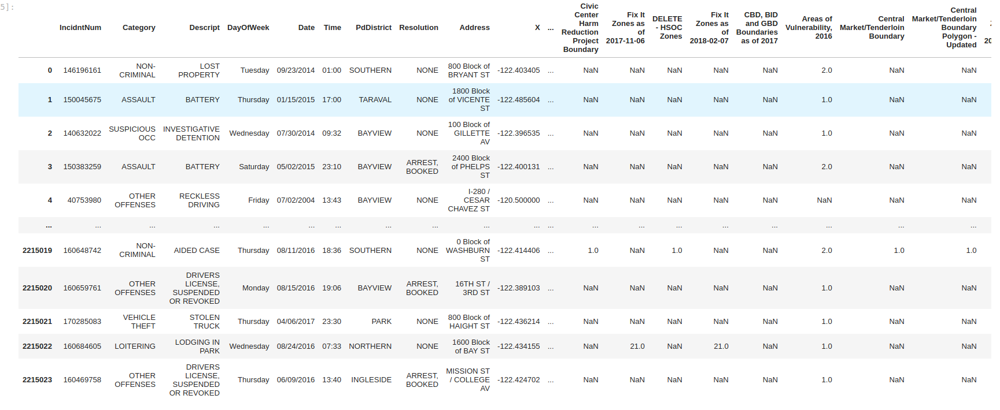
    
<b>Analysis</b>

Due to the size of the dataset, I initially started out using spark via a docker container. Using spark allowed quick exploration of the data and let me figure out which columns were extranneous. I also included SQL queries when probing which descriptions are considered "violent" vs "non-violent" crime by using the LIKE command.

Ultimately I eliminated 20 columns and partitioned the data out by year. The data could then be read into pandas dataframes, which I find more comfortable to use for detailed analysis and plotting. 

<b>General Process Flow:</b>

Read data in spark -> explore via spark and SQL -> filter spark dataframes -> transform to pandas -> explore, plot and calculate   
   

   
   
### Animated Crime Map
   
Plotting the number of reports over time. Note that the overlay is the neighborhoods, not the police districts. This map was created by binning the crime GPS data and then plotting those over a <a href="https://data.sfgov.org/Geographic-Locations-and-Boundaries/Analysis-Neighborhoods/p5b7-5n3h">shapefile of San Francisco Neighborhoods.</a>     
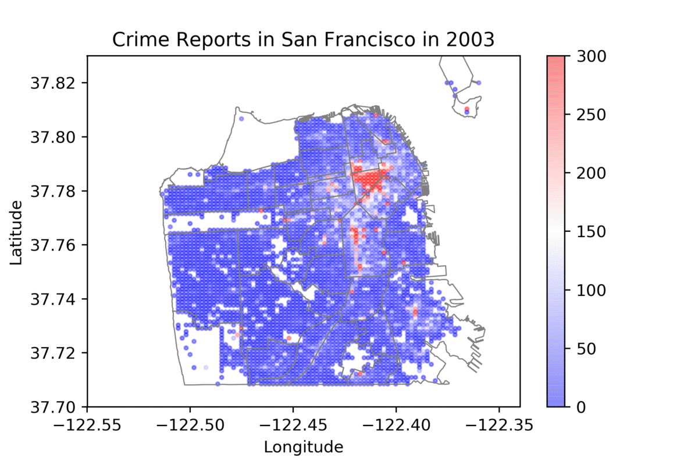 
   
   
   

## General Crime Statistics
   
The top 10 crimes as classified by Description using tree mapping:
    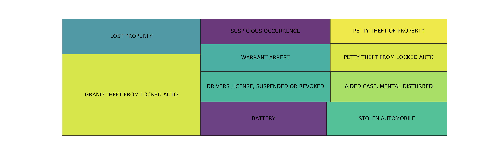
    
    
The total number of crimes and the fraction of those that are violent
    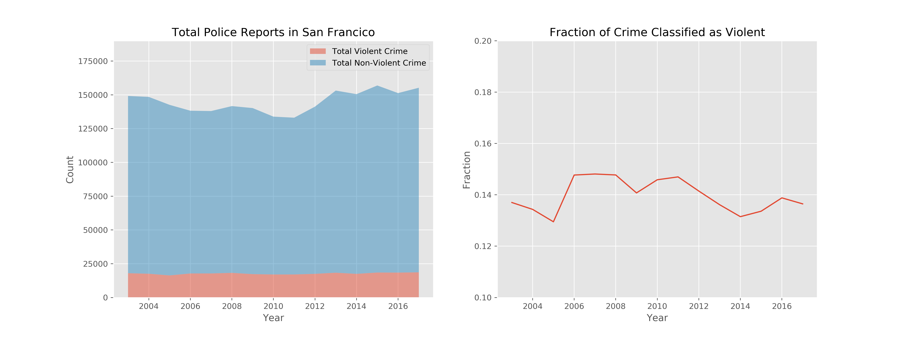
    
    

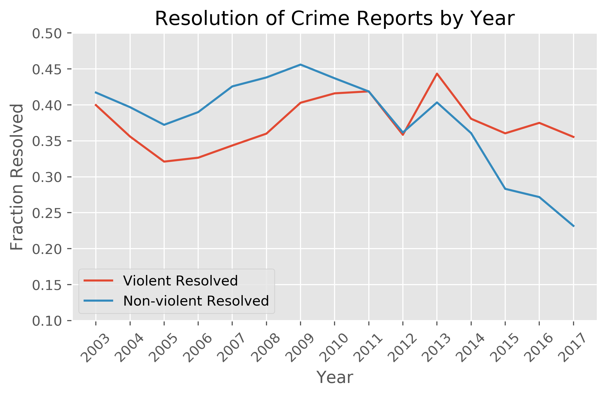

    
    
    
<b>Initial Observations:</b>

- The total number of crimes increases slightly, but mostly due to an uptick in non-violent crime. <b>Could a portion of this be due to car break-ins? </b>

- The number of reports increased from 2003 to 2017, although there are some fluctuations. Census data show the population has increased ~ 8.7% from 2010 to 2019, while the crime rate increased by ~ 15.6% from 2010 - 2017. 
    
- Resolution of non-violent crime is trending downwards after 2014
    
    

## Car Break-Ins

My hypothesis is that theft from vehicles increased markedly after 2014. The stacked plot shows the number of thefts with the number of reports not related to thefts from vehicles. I also plotted the fraction of crimes attributed to theft from 2003-2017. 

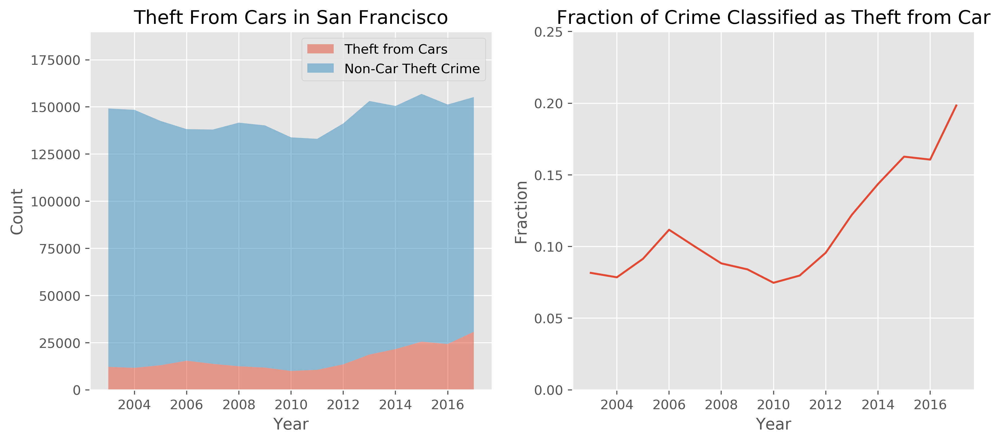

While the incidence of car break-ins does increase after 2014, clearly the trend started around 2012. The peak at 2006 followed by a decline and bottoming out in 2009-20011 suggest that the recession had an effect on theft from vehicles. It's likely that the gentrification and economic boom in San Francisco following the recession has a higher correlation with thefts than the passing of Proposition 47.   

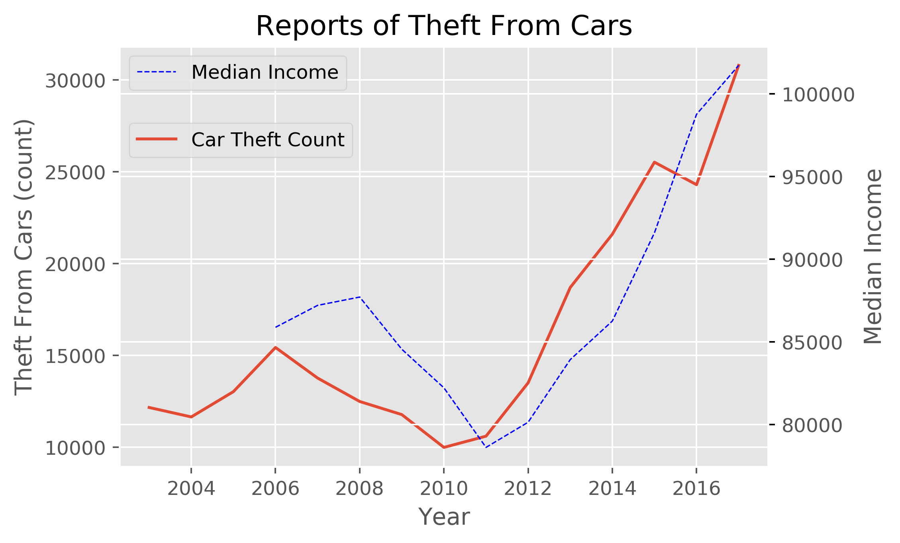

The stats.spearmanr() method was used to look at the correlation coefficient and p-value between the two datasets. Note that Pearson's method requires the two datasets to be normally distributed, which is why I used the <a href="https://docs.scipy.org/doc/scipy-0.14.0/reference/generated/scipy.stats.spearmanr.html">Spearman's correlation</a>. 
- Correlation coefficient 0.76
- P-value of 0.0045

The correlation coefficient is positive and in the upper quartile, indicating a medium positive relationship between the two datasets. The p-value is low; the probability of seeing this relationship given there is no correlation is 0.45% and we can conclude that there is a relationship between thefts from vehicles and median income at a significance level of 0.05. 

## Digging Deeper: Time Series Analysis and Forecasting

    
### Time Series Analysis

Time Series Analysis included looking at the trend-seasonal-residual composition of the crime and modeling via ARIMA. Crime was forecasted through 2020 using the paramters found in the best fit ARIMA model. 

The [statsmodels](https://www.statsmodels.org/stable/tsa.html) library was used for all time series analysis and data was resampled at different intervals prior to differencing. 

The order of operations were as follows:
1. Resample data at various intervals to look at the TSR decomposition.
2. Transform our non stationary series into a stationary series using differencing.
3. Fit and ARIMA model to the stationary series, picking an initial p, q, r and then doing a grid search for the optimal parameters
4. Forecasting using the best fit ARIMA model

Here is a breakdown of the daily and hourly crime reports from 2003-2017. There is a lot to unpack here!

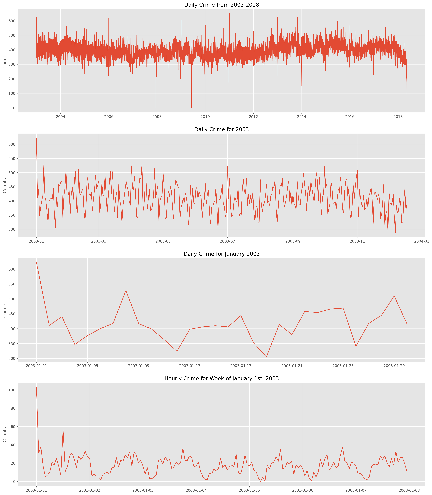

A quick visual analysis shows that there tends to be a drop in crime right around December 25th and a huge spike around January 1st. 

### Nothing happens at 4am

Do crime reports follow a uniform distribution? My intuition says no - some types of crime require criminals/victim interaction, and these are more likely to occur at different times of day. Plotting both the hour of crime reports and the day of the week show that crime follows a predicatable pattern. 

I plotted all the years on top of each other. While that makes it hard to see the year over year change, it makes is very easy to see that there is a predictable pattern every year. The smeared out regions on the tops of the bars show the slight variation year to year. 

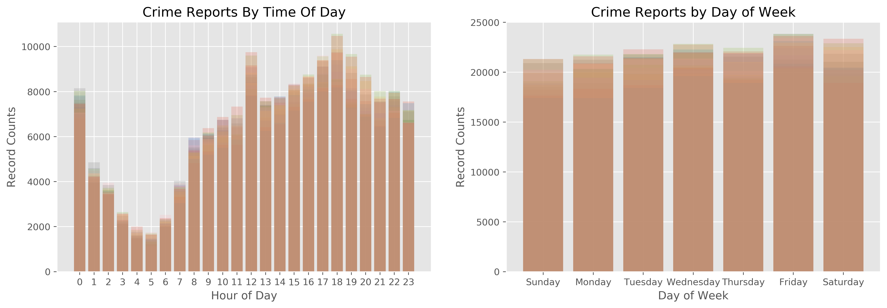
    

    
    
## Crime By District    

San Francisco has 10 police districts and 36 official neighborhoods. I wanted to explore how the crime rate changes in each neighborhood, but instead had to go by each district based on the data avilable in the dataset.

My hypothesis: Income changes both the number of crime reports and the fraction of resolved reports

<b>Neighborhoods vs Police Districts</b>
<table>
    <th>SF Neighborhoods</th>
    <th>PD Districts</th>
    <tr>
        <td>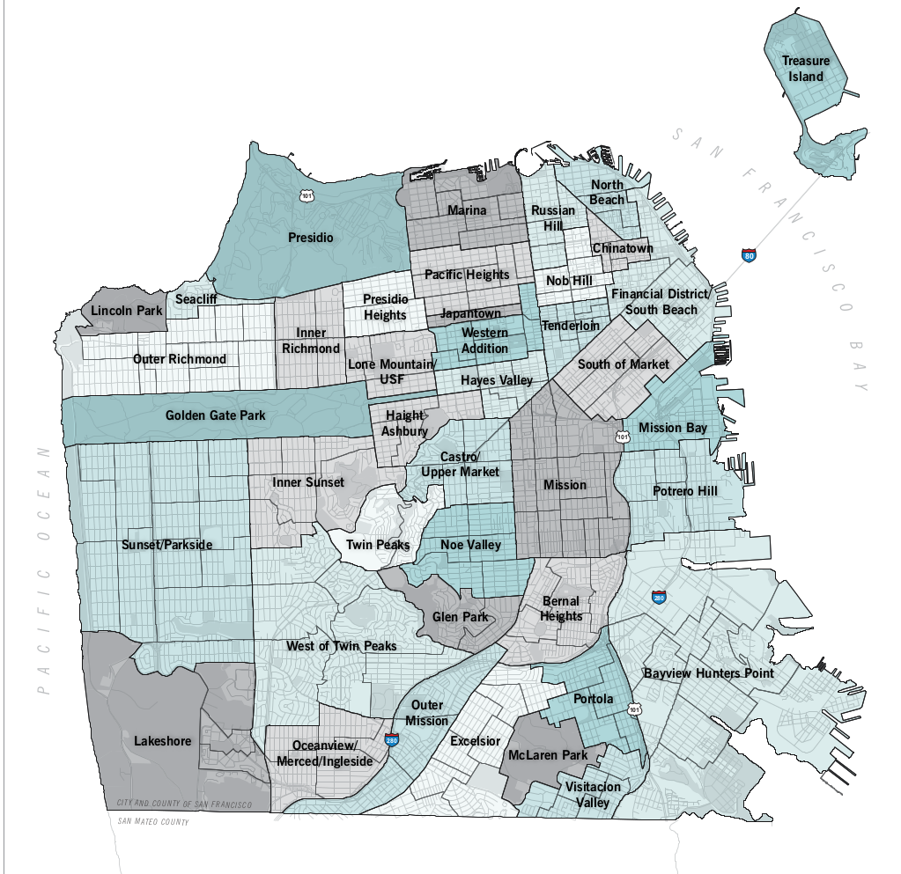</td>
        <td>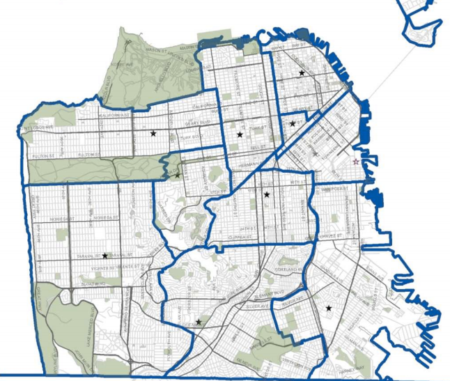</td>
    </tr>
</table>
    

    
Here is the data looking at income relative to crime counts.

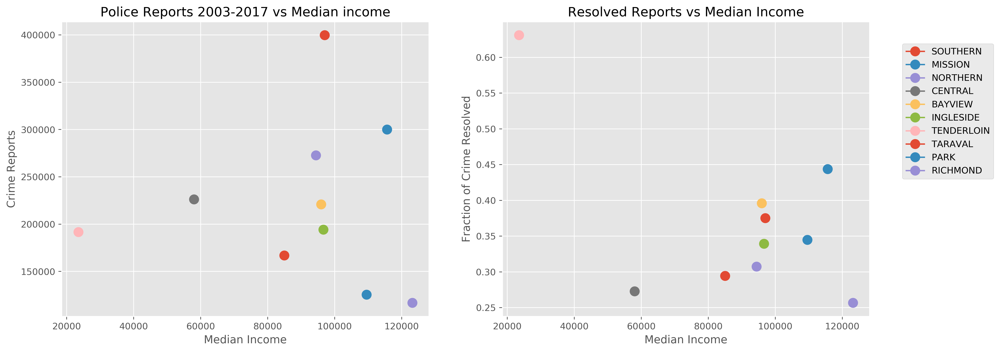

    
Clearly there is no trend in the crime reports vs income. I was unable to quantitatively answer this question due mostly to a lack of data collection, as the previous conclusion looking at thefts from cars is that income does play a role in crime. 

- What really matters here is crime reports per population. I was unable to find the population of each district given the time constraint and it's an unreasonable assumption that each district has the same population

- I also need the neighborhood income/population instead of the district income/population

- Several demographic factors need to be taken into account. Some neighborhoods are very low income becuase they are populated with students, while others are low income due to extensive drug use and homelessness. 

Many of the police districts span both high crime and low crime neighborhoods as well as high income and low income neighborhoods. The consequence of this is that it's difficult to draw correlations between crime reports and demographic variables since most districts have a wide range in demographics.

## Conclusions

- Crime in San Francisco has definitely increased in the past few years due to an uptick in non-violent crime
- An increase of car theft is a partial cause of this increase, but the increase started before the passage of Prop 47 in 2014
- There is a strong correlation between car break-ins and median income in San Francisco. 
- More demographic data is needed to look at interesting trends within neighborhoods. 

<b>On the project side</b>

I really enjoyed playing around with the data. Working in spark and SQL was very informative and a good way to practice the skills I've learned. I loved making the GIF with the shapefile overlay, even though it ended up being quite challenging and took up a fair amount of time. I also tried many, many failed methods of creating an interactive map and was mostly stymied by Plotly not working. 

I do wish I had been able to do more hypothesis testing, but struggled with finding data that represented a statistical distribution rather than a scatterplot of crime. 

## Notes

The project is broken up into 3 notebooks:
- crime.ipynb, which takes in the csv listed below and transforms it into 15 csv files, one for each year
- crime_analysis.ipynb, which imports the data as pandas and does the plotting and calculations
- Heat Map.ipynb, which has the code for importing the shapefile and creating a heat map of crime across SF

There are also a couple helper files located in the src directory, although as I was working through the data I ended up abondoning a few of the plotting functions in favoring of hard coding. The binning and filtering are done in the helper files. 

Lastly, there are several shapefiles downloaded from San Francisco Geographical Information Repository, found below. These are contained in the AnalysisNeighborhoods folder. 

<b> Sources</b>
- Police Crime Statistics: https://data.sfgov.org/Public-Safety/Police-Department-Incident-Reports-Historical-2003/tmnf-yvry
- San Francisco Geographical Information: https://data.sfgov.org/Geographic-Locations-and-Boundaries/Analysis-Neighborhoods/p5b7-5n3h"
- Income Information: https://www.deptofnumbers.com/income/california/san-francisco/ and https://sfgov.org/sfplanningarchive/sites/default/files/FileCenter/Documents/8779-SFProfilesByNeighborhood_2010May.pdf

   