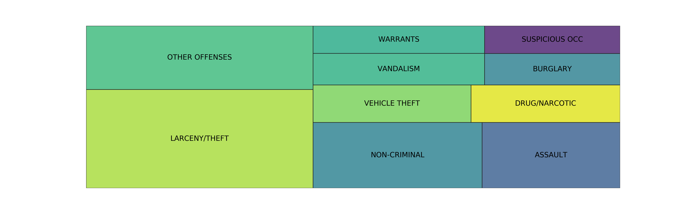
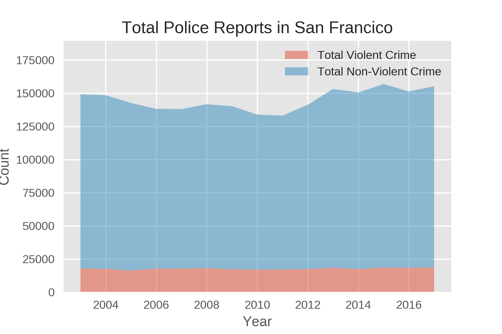
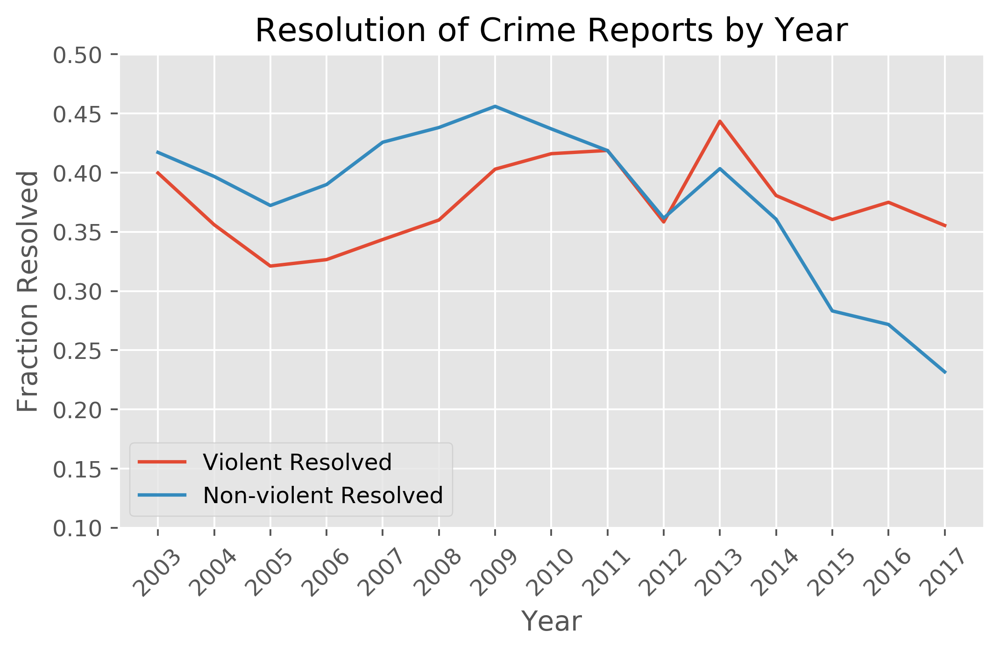
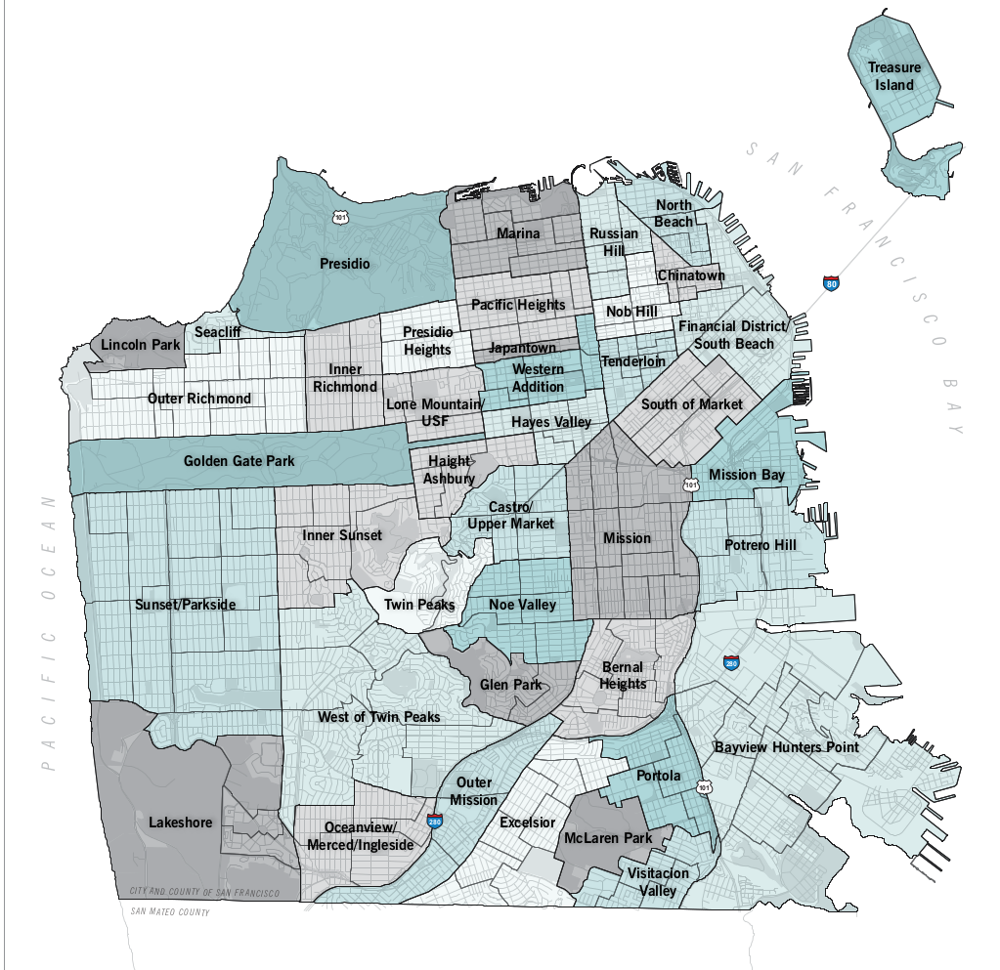
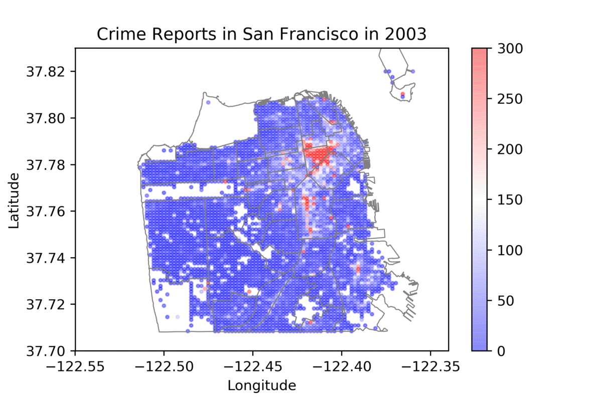

# sfcrime

# Crime in San Francisco: 2003-2017

## Introduction 
The San Francisco Police Department keeps records of all crime reports, including information such as crime location, description, date & time, and whether or not the crime as resolved. The dataset spans 15 years, giving insight into trends in the crime rate as the demographics of the city changes and new laws are enacted. 

In 2014, Proposition 47 was passed in California. This proposition, which classified many non-violent crimes as misdemenors, was aimed at reducing prison populations and preventing highly punitive punishments for relatively minor crimes. 

I initially set out to find whether or not the level of theft from car break-ins increased markedly relative to other crime after the passing of this proposition. I also anticipated that the rate of resolving said crimes would be lower. While that question is answered in a fairly qualitative way, I also spent time doing general exploratory data analysis to look at different aspects of crime in San Francisco. 

## Dataset overview

Overview of the dataset:
- Over 2 million entries
- 33 columns, including Category, Description, Address, and X & Y GPS coordinates
- <some intersesting fact>
    
    
The top 10 crimes as classified by category:
    
    
The top 10 crimes as classified by description:
    
    
    
The total number of crimes and the fraction of those that violent
    

The resolution of both violent and non-violent crimes 
    
    
    
There are a few conlcusions we can already draw:
    - The total number of crimes increases slightly, but mostly due to an uptick in non-violent crime. Getting the rate as a function of population would be good to have. 
    - Resolution of non-violent crime is trending downwards after 2014
    
    
## Digging more into the data: crime in neighborhoods
    
San Francisco is broken up into ~40 neighborhoods and 10 Police Districts. Below are the maps of the two:
        
        
    
   
Plotting the number of reports over time. Note that the overlay is the neighborhoods, not the police districts.     
    
    
    
    
    

## Conclusion

While establishing a correlation between two variables is possible, crime rate is affected by so many variables that it's difficult to draw any concrete conclusions. In some cases, the data isn't detailed enough to tease out potentially important relationships and I'd like to spend more time researching San Francisco demographics to draw a clearer picture. 

Specifically, I'd like to:
- Calculate crime statistics by neighborhood, not PD Districts. There are only 10 police districts in San Francisco, but over 40 neighborhoods. It's not unusual for a single district to contain both a very high income neighborhood and a very low income neighborhood, smearing out any differentiation by income.
- Dig in more into violent crime vs non-violent crime per nighborhood
- Get more information on crime per 100k people. The crime count in a particular district isn't a telling number; it's the crime per population that truly distinguishes a high crime area from a low crime area.

There is a possibility that people stopped reporting break-ins once they knew the police were unlikely to pursue. It's also possible that crime over all increased or decreased, so the important metric is ratio of car break ins to violent crime. 

## Does gentrification lower the rates of violent crime?
Did violent crime in the Mission lower (relative to non-violent crime) from 2003 to 2017?

Other cool things to look into: types of crime peaking during recession. Did crime across the board peak during recession?

Are most crimes committed at night? Does location change when 

Can we create a "worst case scenario"? ie a day, date, time, neighborhood where crime will happen?
